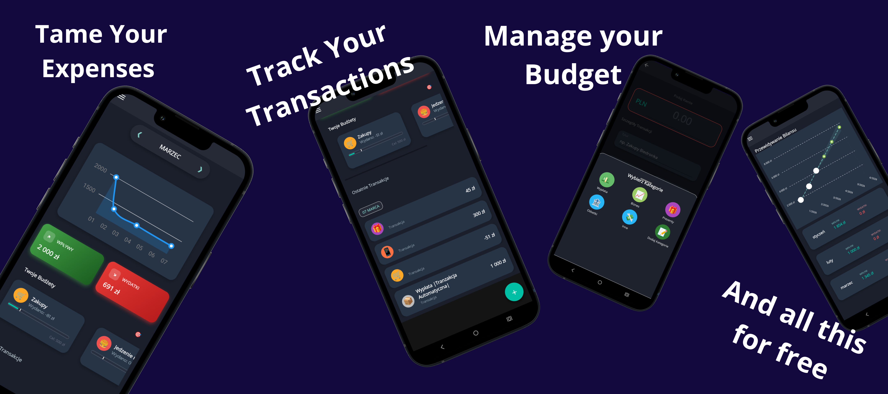

# 💰 Wild Wallet - Personal Finance Manager

**Wild Wallet** is a modern, minimalist mobile application for personal budget management, officially available on **Google Play**. The project focuses on high performance, clean architecture (**MVVM**), privacy (Offline-first), and an aesthetic Dark Mode designed in a "Fintech" style.

The app allows users to track financial flows in real-time, analyze expenses via interactive charts, build saving habits, and maintain control over their wallet without unnecessary distractions.

---

## 📱 App Overview

  

  <i>Wild Wallet in action - Dashboard, Transaction History, and Balance Projection.</i>

---

## 🛠️ Technologies & Architecture

The project is built following software engineering best practices:

* **Framework:** .NET MAUI (.NET 9)
* **Pattern:** MVVM (Model-View-ViewModel) using `CommunityToolkit.Mvvm`.
* **Database:** SQLite + **Entity Framework Core** (Code First approach).
* **Visualization:** LiveCharts2 (Dynamic Cartesian charts).
* **Dependency Injection:** Built-in .NET container.

## ✨ Key Features

- [x] **Finance Tracking:** Seamless recording of income and expenses.
- [x] **Visual Analysis:** Interactive line charts showing financial trends.
- [x] **Saving Streak:** Gamified system motivating users to save money consistently month by month.
- [x] **Smart Dashboard:** Tiles with a quick summary of the current balance and dynamic gradients.
- [x] **Multi-Currency Support:** Dynamic currency formatting (PLN, EUR, USD, etc.) based on user preference or device region.
- [x] **Data Portability:** Secure CSV export and import capabilities ensuring users own their data.
- [x] **Local Database:** All data is stored securely on the device (SQLite) - no cloud dependency.
- [x] **Dark Mode:** User interface designed in a modern "Fintech Dark" theme.
- [x] **Linear Regression:** App can estimate your future balance based on historic data.

---

## 🚀 Roadmap (Future Development)

I am currently working on expanding the application's capabilities:

- [x] **Google Play Release:** My biggest dream (aside from being employed) has been achieved! 🎉
- [x] **Full Transaction Editing:** Ability to modify amount, date, and category.
- [x] **Category Management:** Custom categories with icons and colors.
- [ ] **Wallets:** Multi-account support (Cash, Bank Account, Savings).
- [ ] **Biometric Security:** App lock via Fingerprint/FaceID.

---

## 📬 Contact

If you have any questions, suggestions, or would like to collaborate – feel free to reach out via GitHub or LinkedIn.

---
*Created with ❤️ using .NET MAUI*
