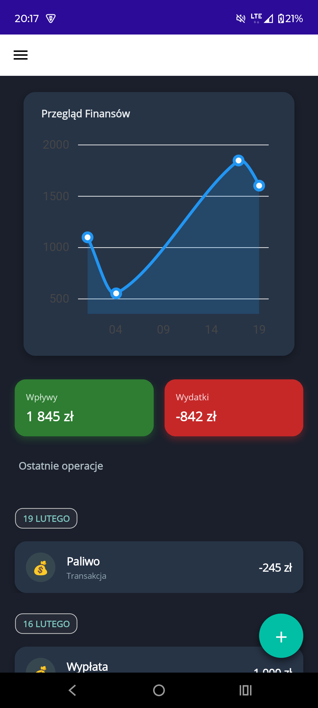
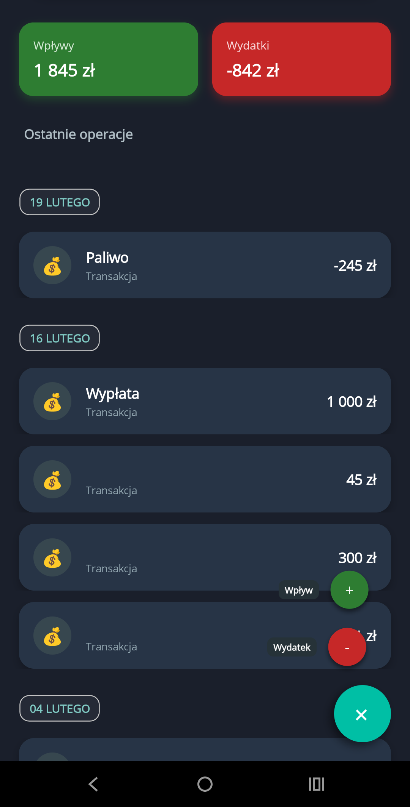
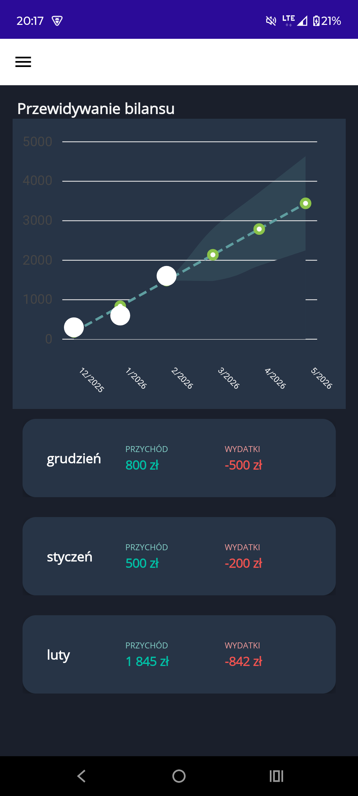

# 💰 Wild Wallet - Personal Finance Manager


**Wild Wallet** is a modern, minimalist mobile application for personal budget management. The project focuses on high performance, clean architecture (**MVVM**), and an aesthetic Dark Mode designed in a "Fintech" style.

The app allows users to track financial flows in real-time, analyze expenses via interactive charts, and maintain control over their wallet without unnecessary distractions.

---

## 📱 App Overview (Screenshots)

| 📊 Main Dashboard | ➕ Add Transaction | 📝 Transaction History |
|:---:|:---:|:---:|
|  |  |  |
| *Trend analysis & Balance* | *Quick expense entry* | *Detailed operation list* |

---

## 🛠️ Technologies & Architecture

The project is built following software engineering best practices:

* **Framework:** .NET MAUI (.NET 8)
* **Pattern:** MVVM (Model-View-ViewModel) using `CommunityToolkit.Mvvm`.
* **Database:** SQLite + **Entity Framework Core** (Code First approach).
* **Visualization:** LiveCharts2 (Dynamic Cartesian charts).
* **Dependency Injection:** Built-in .NET container.

## ✨ Key Features

- [x] **Finance Tracking:** Seamless recording of income and expenses.
- [x] **Visual Analysis:** Interactive line charts showing financial trends.
- [x] **Smart Dashboard:** Tiles with a quick summary of the current balance.
- [x] **Local Database:** All data is stored securely on the device (SQLite).
- [x] **Dark Mode:** User interface designed in a modern "Fintech Dark" theme.

---

## 🚀 Roadmap (Future Development)

I am currently working on expanding the application's capabilities:

* [ ] **Full Transaction Editing:** Ability to modify amount, date, and category.
* [ ] **Wallets:** Multi-account support (Cash, Bank Account, Savings).
* [ ] **Category Management:** Custom categories with icons and colors.
* [ ] **Statistics Module:** Unlocking advanced insights after collecting 3 months of data.

---

## 📥 How to Run

1.  Clone the repository:
    ```bash
    git clone [https://github.com/YourUsername/WalletMAUI.git](https://github.com/YourUsername/WalletMAUI.git)
    ```
2.  Open the solution in **Visual Studio 2022**.
3.  Ensure you have the **.NET Multi-platform App UI development** workload installed.
4.  Build and run on an Android Emulator or a physical device.

---

## 📬 Contact

If you have any questions, suggestions, or would like to collaborate – feel free to reach out via GitHub or LinkedIn.

---
*Created with ❤️ using .NET MAUI*
